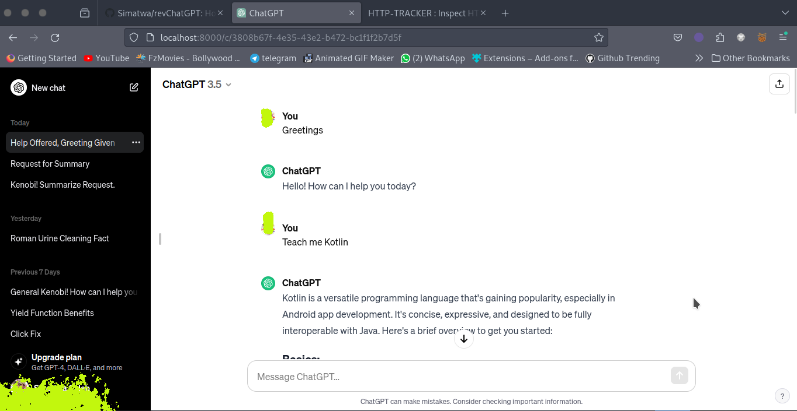
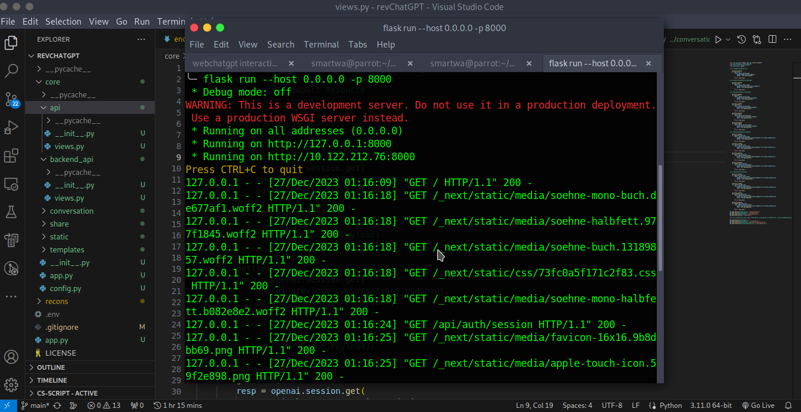

<h1 align="center"> revChatGPT </h1>

<p align="center">
<a href="LICENSE"></a>
<a href="https://github.com/psf/black"></a>
<a href="#"></a>
<a href="#" alt="progress"></a>
<!--<a href="https://github.com/Simatwa/revChatGPT/releases"></img></a> -->
<a href="https://github.com/Simatwa/revChatGPT/releases"></img></a>
<a href="https://github.com/Simatwa/revChatGPT/releases"></img></a>
<a href="https://hits.seeyoufarm.com"></a>
<a href="https://wakatime.com/badge/github/Simatwa/revChatGPT"></a>
</p>

This project provides a customizable web interface for ChatGPT, allowing you to host it locally and seamlessly forward user requests to OpenAI for response generation. 

<p align="center">
 

</p>


## **Use Case**

1. Education and Learning:
   - **Use Case**: Educators or students interested in understanding how ChatGPT's interface works or teaching/learning web development.
   - **Benefit**: Provides a hands-on learning experience, exploring frontend development, API integration, and web technologies used in the ChatGPT interface.


2. Research and Development:
   - **Use Case**: Researchers or enthusiasts interested in analyzing, modifying, or extending the ChatGPT web interface.
   - **Benefit**: Supports studying conversational AI interfaces, user interactions, or conducting experiments in a controlled environment.

3. UI/UX Customization:
   - **Use Case**: Individuals who find the existing UI/UX not cool, they can come up with one that suits their tastes and preferences.
   - **Benefit**: Provides an opportunity to modify, adapt, or extend the interface to align with specific branding or UI/UX requirements

4. Privacy and Security:
   - **Use Case**: Concerned about data privacy or security, especially for sensitive conversations or testing confidential information.
   - **Benefit**: One gets to know which kind of data you're sharing with OpenAI in real time.

5. Localized Deployment:
   - **Use Case**: Operating in regions with restricted internet access or as part of an intranet system.
   - **Benefit**: Allows for localized deployment, ensuring access to the ChatGPT interface within specific network boundaries or regions with limited internet connectivity.

## Installation

- Clone repo and install dependencies

```
git clone https://github.com/Simatwa/revChatGPT.git
pip install -r requirements.txt
```

## Usage 

- You need cookies to bypass the login stage. That has been well documented in [WebChatGPT](https://github.com/Simatwa/WebChatGPT). Just in summary the doument reads:

The script utilizes [HTTP Cookies](https://en.wikipedia.org/wiki/HTTP_cookie) and [OAuth](https://en.wikipedia.org/wiki/OAuth) to justify the REST-API requests at [Openai](https://openai.com). 

In order to do that, we will use the [export-cookie-for-puppeteer](https://github.com/ktty1220/export-cookie-for-puppeteer) extension to extract the cookies which will later on used to retrieve the OAuth.

### Procedure

1. Login to https://chat.openai.com
2. Upon successfull login, use **Export cookie JSON File Puppeteer** to export cookies. If you haven't installed the extension, here are  the quick installation links for you. 
 - [Google Chrome](https://chrome.google.com/webstore/detail/nmckokihipjgplolmcmjakknndddifde)
- [Firefox](https://addons.mozilla.org/ja/firefox/addon/%E3%82%AF%E3%83%83%E3%82%AD%E3%83%BCjson%E3%83%95%E3%82%A1%E3%82%A4%E3%83%AB%E5%87%BA%E5%8A%9B-for-puppeteer/)

By doing that you are almost there.

Make path to the exported cookie file an environment variable identified by `openai_cookie_file` or  simply create a `.env` file at the projects root directory and save the path in the format :

`openai_cookie_file=<path-to-openai-cookie-file>`

> **Recommended** : Edit the [env](env) file as per your preferences and then rename it to *.env*

Fire up the server locally:

`python -m flask run -p 8000`

Then visit http://localhost:8000 .

> **Note** : The server has been tweaked to be relevant only on localhost using port 8000.

Have fun. 

## 🛑 Disclaimer

While our quest involves unraveling the mystical tapestry of ChatGPT's web version, remember—this journey is for academic and exploratory purposes only!

- ⚡️ The mission ahead involves exploring the digital wizardry behind ChatGPT's web interface, but it's crucial to wield your code-swords responsibly.

- 🧙‍♂️ Reverse engineering is a curious spell, but only cast it upon ChatGPT's web version and not for nefarious sorcery or unauthorized mischief.

- 🛡️ While your curiosity is commendable, remember to honor the noble laws of the digital realm—respect intellectual property rights and avoid the dark paths of piracy.

Embrace the adventure, learn the arcane arts, but do so in the spirit of scholarly exploration and ethical wizardry!
